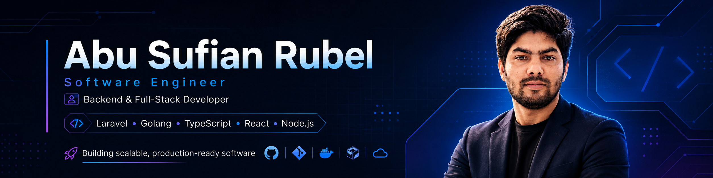

<div align="center">



<br/>

# Hi, I'm Abu Sufian Rubel 👋


<br/>

[](https://github.com/sufianrubel)


</div>

---

## 👨‍💻 About Me

Software Engineer based in **Dhaka, Bangladesh**, with 6+ years of experience building scalable web applications, backend systems, REST APIs, payment platforms, and production-grade business applications.

- 💻 Backend & Full-Stack Development
- ⚡ Laravel, Golang, React, Node.js & TypeScript
- 🏗️ REST APIs, Microservices & System Design
- 🗄️ PostgreSQL, MySQL, MongoDB & Redis
- 🐳 Docker, Linux & CI/CD
- 🤖 AI-assisted software development
- 🎯 Focused on scalable, maintainable and production-ready systems

---

## 🛠️ Tech Stack

<div align="center">


</div>

---

## 💼 Engineering Experience

### Backend Developer — Adventure Dhaka Limited

`Golang` `PostgreSQL` `Redis` `REST API` `Docker`

- Backend systems supporting **10,000+ daily hotel operations**
- REST API and microservice integrations
- PMS integrations including AirHost and Temairazu
- Production reliability and performance optimization
- International engineering collaboration

### Software Engineer — TechVillage Ltd.

`Laravel` `PHP` `MySQL` `REST API`

- Payment platform development
- Multi-vendor eCommerce systems
- Payment gateway & third-party API integrations
- Backend architecture and database optimization

---

## 🚀 Featured Work

**🏨 Hotel Manager Platform**  
Golang • PostgreSQL • Redis • REST API • Docker

**💳 PayMoney**  
Laravel • PHP • MySQL • REST API • OAuth

**🛒 Martvill**  
Laravel • PHP • MySQL • Multi-Vendor eCommerce

---

## 📊 GitHub Analytics

<div align="center">


<br/>


</div>

---

## 🐍 Contribution Activity

<div align="center">


</div>

---

## 🎯 Current Focus

```typescript
const currentFocus = {
    frontend: ["TypeScript", "React", "Next.js"],
    backend: ["Laravel", "Golang", "Node.js"],
    architecture: ["System Design", "Clean Architecture"],
    devOps: ["Docker", "CI/CD", "Linux"],
    exploring: ["AI-Assisted Development"],
};
```

---

## 🤝 Connect With Me

<div align="center">

[](https://github.com/sufianrubel)
[](YOUR_LINKEDIN_URL)
[](YOUR_PORTFOLIO_URL)
[](mailto:YOUR_EMAIL)

</div>

---

<div align="center">

### Build • Learn • Improve • Repeat

**Clean code. Scalable architecture. Real-world impact.**

⭐ Explore my repositories and feel free to connect.

</div>
